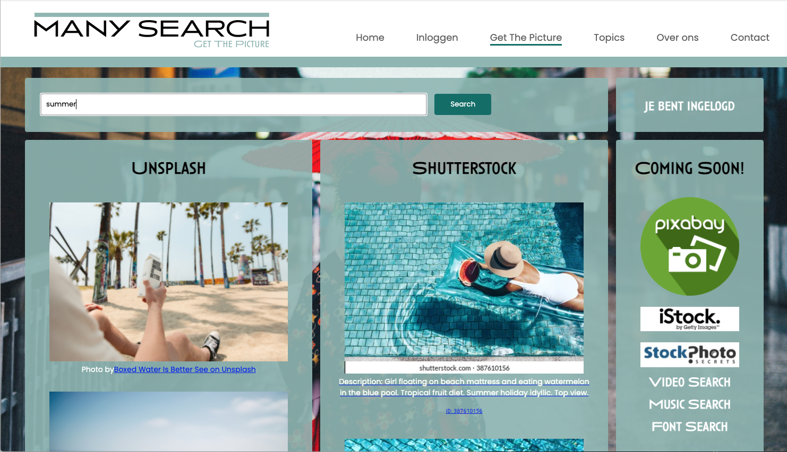
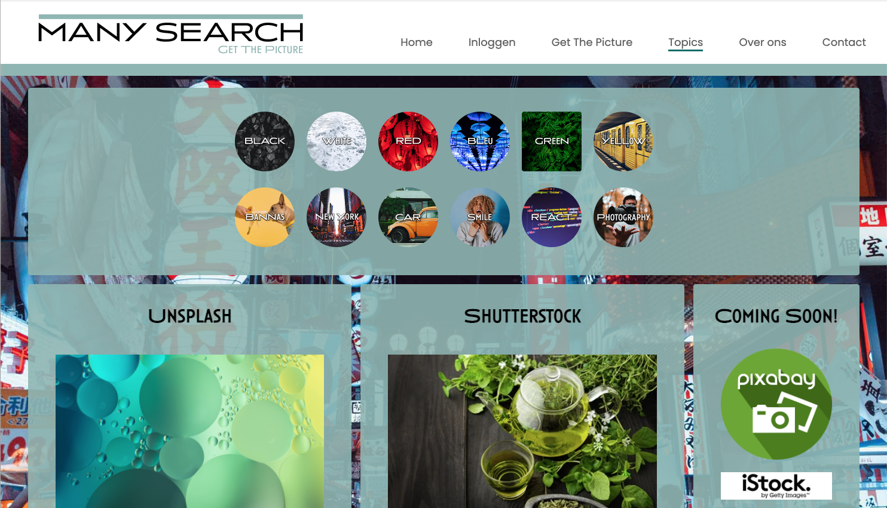
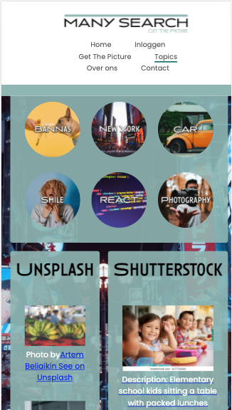

### Eindopdracht MJ Novi Aug 2021

# Inhoudsopgave
1. Inleiding
2. Benodigdheden
3. Installatie handleiding
4. Scripts NPM

## Welkom

De site is ontstaan omdat wij vaak op stockfoto’s zoeken maar niet steeds wilden wisselen van site maar de foto’s naast elkaar wilde zien van verschillende aanbieders. In deze site zijn nu Shutterstock en Unsplash toevoegt waar je met 1 zoekwoord de resultaten mooi naast elkaar ziet van beide.

Als je nog niet geregistreerd bent kan je de pagina’s 'Get The Picture' | 'Topics' | 'About' nog niet zien. Dus registeer je om van alle faciliteiten te kunnen gebruiken. Indien je opmerking/suggesties heb vul dan het contactformulier in en stuur ons een bericht.

# Benodigdheden
1. Node.js
2. NPM
3. Github
4. Google account (firebase) | [Firebase Google](https://firebase.google.com/) 
5. Shutterstock developer account |  [Shutterstock developers](https://www.shutterstock.com/developers)
6. Unsplash developer account | [UnSplash Developers](https://unsplash.com/developers)

# Installatie handleiding
1. Clone de git repository
2. Geef in de terminal het commando
   
   ## npm install

3. Maak een .env bestand aan en zet daar de volgende code in:

>REACT_APP_API_KEY= Unsplash 
REACT_APP_API_TOKEN= Shutterstock token 
REACT_APP_API_SSCLIENT= Shuterstock Client  
REACT_APP_API_SSSECRET=Shutterstock Secret 
REACT_APP_API_FBKEY= Firebase 
REACT_APP_API_FBMSG= Firebase 
REACT_APP_API_FBAPPID= Firebase 
REACT_APP_API_FBMEAS= Firebase 

4. Om de App te starten geef je het commando 
   
    ## npm start

(deze openen in http://localhost:3000)

# Scripts NPM

>‘start’ 	| starten van een project 
‘build’	| Optimaliseert JavaScript, HTML en CSS bestand voor productie 
‘test’	| Voert de unit testen uit 
‘eject’	| Alle configuratie zichtbaar 